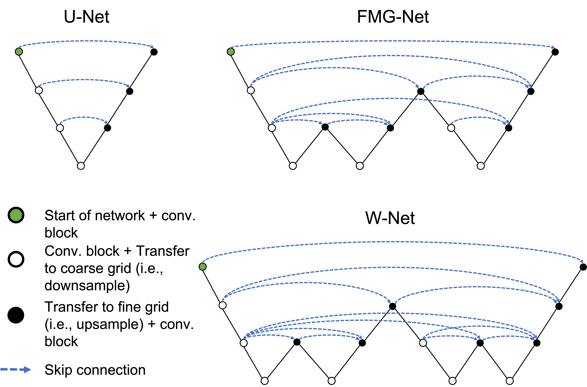

# FMG-Net and W-Net: Multigrid Inspired Deep Learning Architectures for Medical Imaging Segmentation

Implementation of FMG-Net and W-Net based on the [MIST](https://github.com/aecelaya/MIST) framework. 

Both networks are implemented in TensorFlow. PyTorch versions are in progress.

Please cite the following if you use these architectures or code for your work

> A. Celaya et al., "PocketNet: A Smaller Neural Network For Medical Image Analysis," in IEEE Transactions on Medical Imaging, doi: 10.1109/TMI.2022.3224873.
>
> A. Celaya, B. Riviere, and D. Fuentes., "FMG-Net and W-Net: Multigrid Inspired Deep Learning Architectures for Medical Imaging Segmentation," arXiv preprint arXiv:2304.02725, 2023.


## About FMG-Net and W-Net
The V-cycle, W-cycle, and FMG-cycle are different implementations of GMMs, with varying 
complexities and convergence properties. The V-cycle is the simplest and a commonly used 
multigrid method, where a sequence of smoothing and restriction operations are performed 
on the system at multiple grid levels, followed by a sequence of prolongation operations 
with corrections (i.e., skip connections) to interpolate the solution back to the finest 
grid. The W-cycle and FMG-cycle are more complex and computationally intensive, but they 
offer superior convergence properties by performing additional smoothing, interpolation, 
and correction operations at intermediate grid levels.

Given that the U-Net architecture and the V-cycle are nearly identical, we propose the 
FMG-Net and W-Net architectures which mirror the structure of the FMG and W-cycles, 
respectively. We hypothesize that these architectures, with more complex interactions 
between features at intermediate grid levels than the U-Net, can achieve superior 
segmentation performance and faster convergence to lower loss function values. 
The first figure seen below sketches the U-Net, FMG-Net, and W-Net architectures 
for various network depths. Note that we define the depth of each network to be the number 
of different resolution grids used by each architecture. The following rules govern the 
skip connections in each of these networks:

1. If we transfer features to a coarser grid (i.e., are on a encoder branch), then we pass all of the features to all subsequent upsampling operations at the current grid level.

2. If we encounter a "peak" (i.e., a transfer to a finer grid immediately followed by a transfer to a coarser grid), then we pass the features from the peak only to the next set of features at the same grid level.

The second figure seen below illustrates these skip connection patterns for the U-Net, 
FMG-Net, and W-Net for the network depth set to three. In addition, each convolutional 
block (i.e. conv. block) consists of two convolutions, each followed by batch normalization 
and a ReLU non-linearity. Finally, we use the 
[PocketNet paradigm](https://ieeexplore.ieee.org/document/9964128) for the FMG-Net and W-Net, 
and do not double the number of features after downsampling to a coarser grid.




## Setup
### Requirements
We include a Dockerfile in this repository that pulls NVIDIA's TensorFlow 2 NGC container and installs the necessary dependencies. Please make sure to have the following components ready.

* [Docker](https://www.docker.com/)
* [NVIDIA Container Toolkit](https://github.com/NVIDIA/nvidia-docker)
* GPU with sufficient memory and compute capacity to handle 3D image segmentation

### Get Started
To start running this pipeline, first clone this repository.

Next we use Dockerfile in this repository to build a Docker image named ```mgnets```.
```
docker build -t mgnets .
```

Once the container is ready, we launch an interactive session with the following command. Notice that we mount a directory to the ```/workspace``` directory in the container. The idea is to mount the local directory containing our data to the workspace directory. Please modify this command to match your system.
```
docker run --rm -it -u $(id -u):$(id -g) --gpus all --ipc=host --ulimit memlock=-1 --ulimit stack=67108864 -v /path/to/your/data:/workspace mist
```

Once inside the container, we can run the training pipeline. Specify the GPU and model that we want to use.
```
python main.py --model <unet, fmgnet, or wnet> --gpu <gpu number (i.e., 0, 1, ...)>
```
